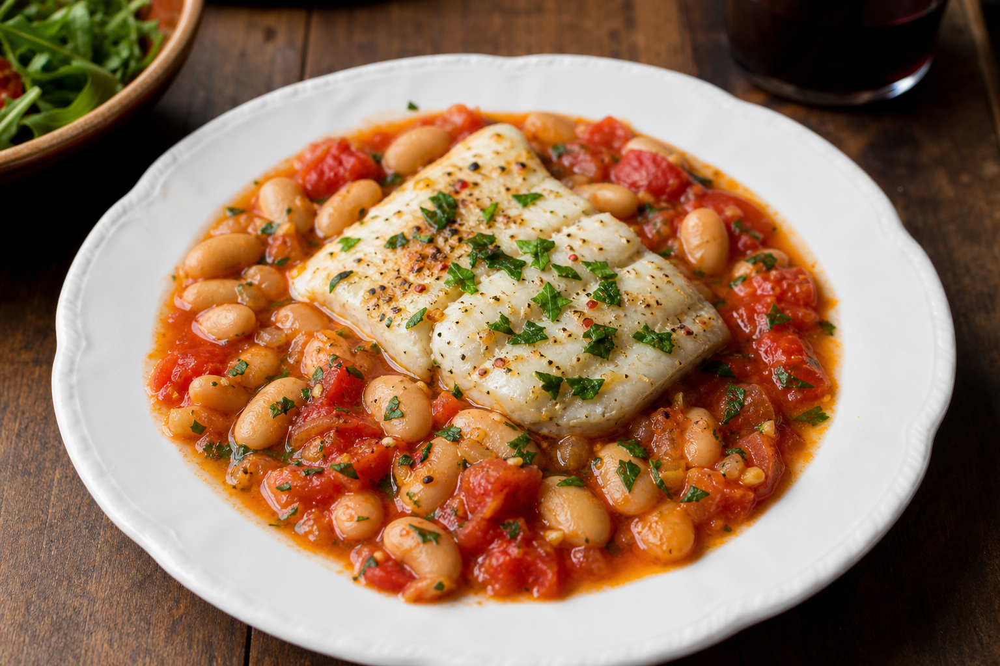

# Baked Cod & White Beans
<!-- quick:20 -->

In a baking dish, mash about a third of {130g {white_bean}} with {10g {olive_oil}}, {5g {garlic}}, {2g {smoked_paprika}}, {1g {oregano}}, and zest from {5g {lemon}} into a rough sauce. Stir in the remaining beans, {150g {tomato}}, and {30g {black_olive}}. Nestle {150g {cod}} into the beans, drizzle with a little more oil, and bake at 190°C for 18 minutes until the fish flakes into the sauce. Finish with {5g {parsley}} and lemon juice.
