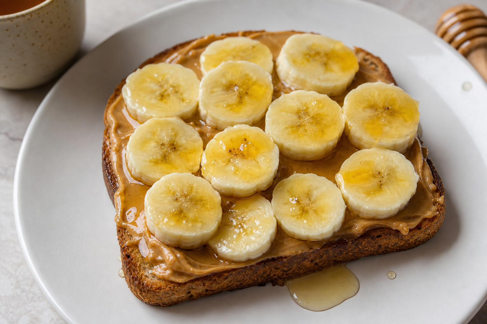

# Peanut Butter Banana Toast
<!-- quick:5 -->

Toast {80g {bread}}. Warm {25g {peanut_butter}} with {5g {honey}} and {1g {cinnamon}} until glossy, then stir in {5g {chia_seed}} so the seeds disappear into the spread. Slather on the toast, top with sliced {100g {banana}}, and dust lightly with {2g {cocoa_powder}}.
