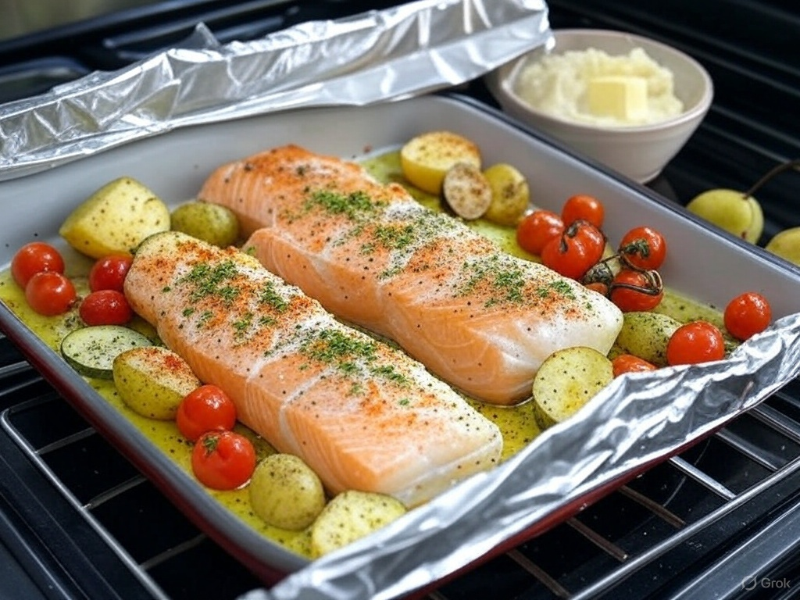

# Salmon & Cod with Potatoes and Tomatoes

- **Preheat Oven**: 200°C
- **Assemble Dish**: In a baking dish, add [Potatoes, russet, without skin, raw; 300; G] (diced), [Fish, salmon, Atlantic, farm raised, raw; 150; G] (fillet), [Fish, cod, Atlantic, wild caught, raw; 150; G] (fillet), [Tomatoes, grape, raw; 100; G], [Onions, red, raw; 50; G] (sliced), [Garlic, raw; 5; G] (minced), and optional [Squash, summer, green, zucchini, includes skin, raw; 100; G].
- **Season**: Drizzle with [Oil, olive, extra virgin; 15; G] (commonly measured in tablespoons, ~1 tbsp), squeeze lemon juice, sprinkle lemon zest, oregano, smoked paprika, [Salt, table, iodized; 2; G], and pepper. Toss gently.
- **Bake**: Cover with foil, bake 25–30 min until fish flakes and potatoes are soft.
- **Mash Potatoes**: Remove fish and veggies, mash potatoes in dish with [Butter, stick, unsalted; 20; G], [Milk, whole, 3.25% milkfat, with added vitamin D; 50; G], salt, and pepper. Serve together.
- **Enjoy**: Pair with [Pears, raw, bartlett; 200; G].

