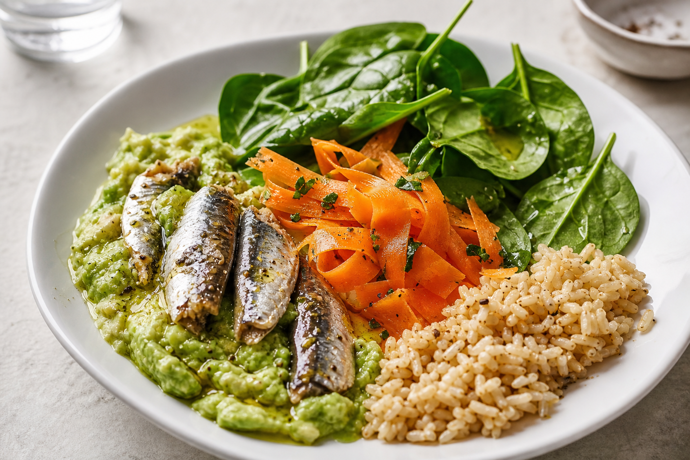

# Sardine Avocado Plate
<!-- quick:8 -->

Mash {100g {avocado}} with {5g {lemon}} juice and a pinch of {1g {black_pepper}}. Pile onto a plate with {120g {sardine}} (drained), {80g {spinach}}, and shaved {60g {carrot}}. Drizzle {10g {olive_oil}} and eat with {60g {brown_rice}} on the side.
