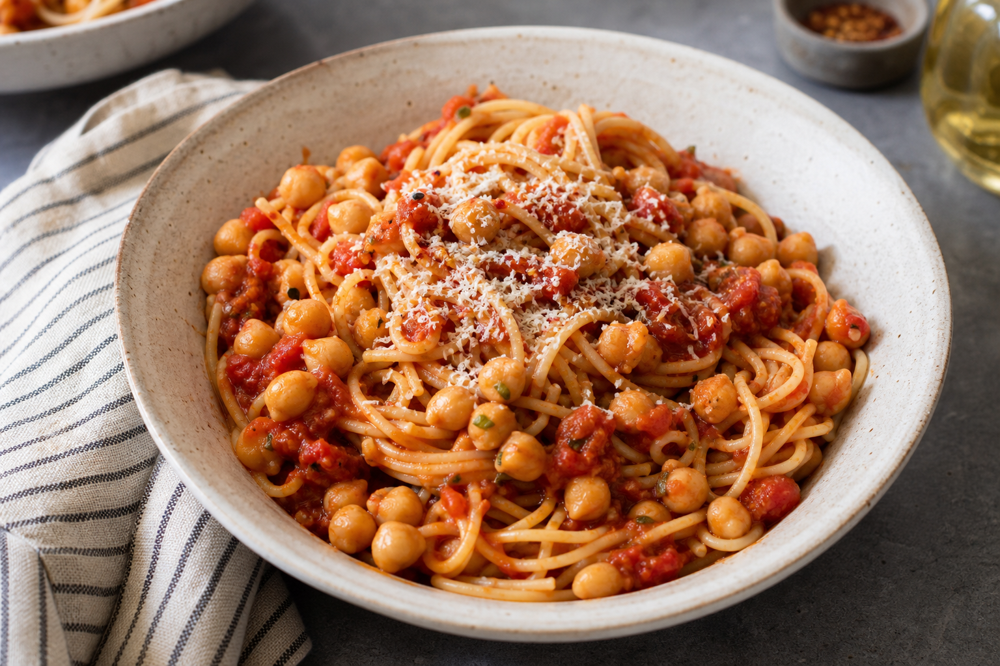

# Pasta Chickpea Pomodoro
<!-- quick:18 -->

Cook {180g {pasta}}. Simmer {130g {chickpea}} with {200g {tomato}}, {5g {garlic}}, and {12g {olive_oil}} for 10 minutes. Toss together and top with {8g {parmesan_cheese}}.
