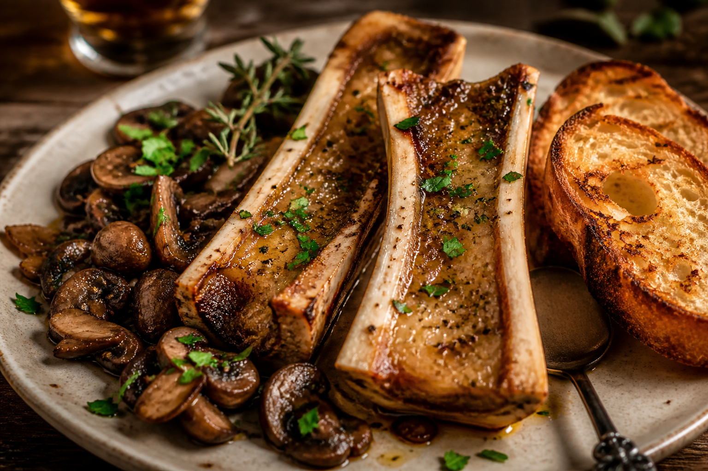

# Bone Marrow & Mushroom
<!-- quick:18 -->

Roast {100g {bone_marrow}} at 220°C for 12 minutes. Sauté {150g {mushroom}} in {10g {butter}} with {3g {garlic}}. Serve marrow scooped onto mushrooms with {60g {bread}} and {5g {parsley}}.
