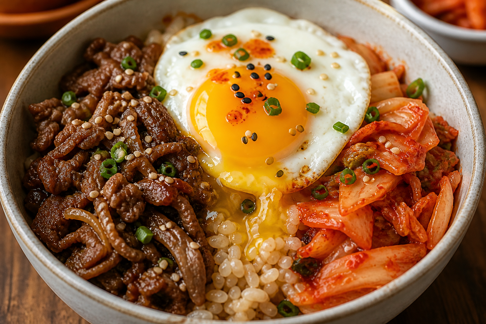

# Beef Egg Kimchi Bowl
<!-- quick:15 -->

Chop {60g {kimchi}} and stir-fry in {10g {sesame_oil}} with {5g {garlic}} until it softens and the pan smells sweet-savory. Add {120g {beef}} (thin strips) and {8g {gochujang}}; cook until the beef is glazed in the kimchi juices. Wilt in {80g {spinach}}, then fold through {100g {brown_rice}} so every grain picks up the sauce. Top with a fried {60g {egg}}, {5g {sesame_seed}}, and {8g {scallion}}.
