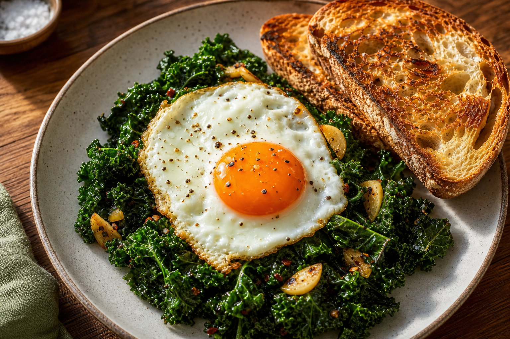

# Egg & Kale
<!-- quick:12 -->

Soft-sauté {20g {shallot}} and {60g {mushroom}} in {10g {butter}} until browned and sweet. Add {120g {kale}}, {3g {garlic}}, and a splash of water; cover briefly so the kale turns tender, not bitter. Fry {80g {egg}} sunny-side up. Pile the greens on {60g {bread}}, top with the egg, crumble over {25g {feta_cheese}}, and finish with {5g {lemon}} juice and {1g {aleppo_pepper}}.
