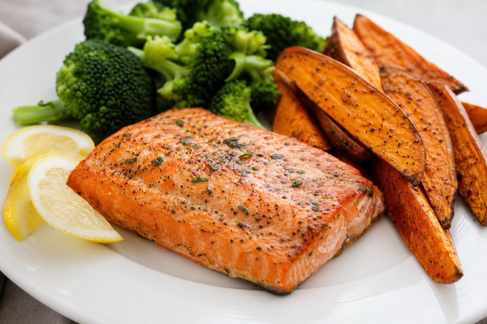

# Cod Liver Sweet Potato
<!-- quick:20 -->

Roast {200g {sweet_potato}} until tender. Pan-fry {100g {cod_liver}} in {10g {butter}} for 2 minutes per side. Sauté {100g {kale}} with {3g {garlic}} in the same pan. Plate together with {5g {parsley}} and {1g {black_pepper}}.
