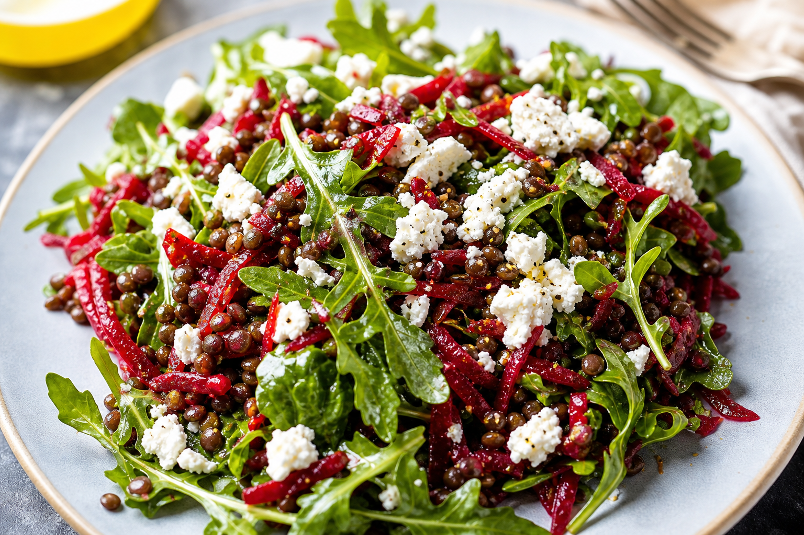

# Lentil Beet Salad
<!-- quick:12 -->

Whisk {12g {olive_oil}}, {8g {balsamic_vinegar}}, {5g {mustard}}, {6g {lemon}} juice, and a pinch of salt into a thick dressing. Toss warm {130g {lentil}} in most of it so they soak it up while still hot. Fold in {70g {beet}} (grated), {60g {arugula}}, and {5g {dill}}. Crumble {40g {goat_cheese}} over the top and let it soften into the lentils, then finish with toasted {15g {walnut}} and the remaining dressing.
