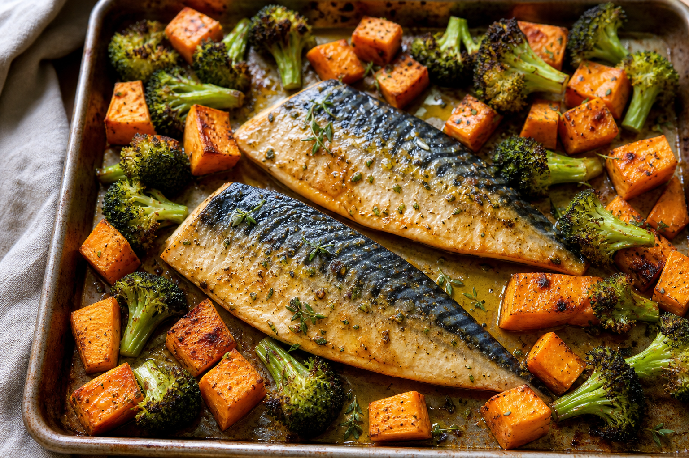

# Mackerel Tray Bake
<!-- quick:25 -->

Cube {200g {sweet_potato}} and {150g {broccoli}}. Toss with {15g {olive_oil}}, {3g {garlic}}, and {1g {salt}}. Lay {150g {mackerel}} fillets on top. Bake at 200°C for 20 minutes until fish flakes and vegetables are tender.
