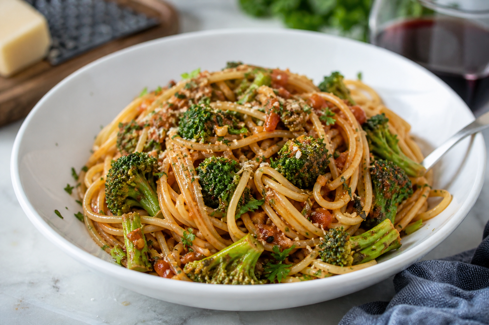

# Anchovy Broccoli Pasta
<!-- quick:15 -->

Cook {180g {pasta}}. Steam {120g {broccoli}} until bright green. Warm {15g {olive_oil}} with {10g {anchovy}} (melted), {5g {garlic}}, and {200g {tomato}}. Toss pasta and broccoli in the sauce. Top with {5g {parsley}} and {5g {parmesan_cheese}}.
