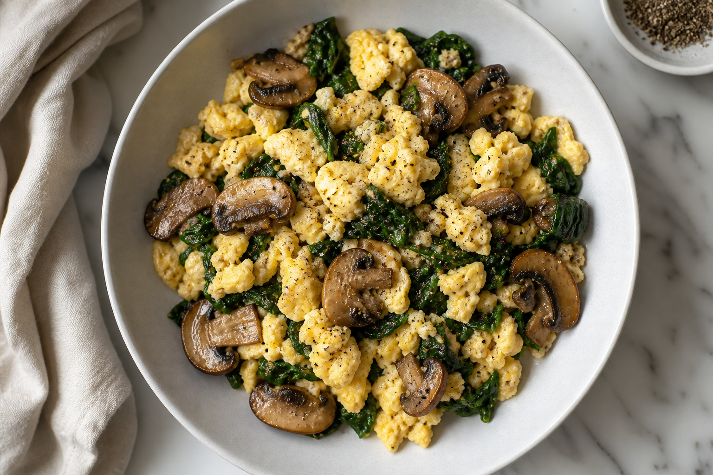

# Spinach Mushroom Scramble
<!-- quick:8 -->

Sauté {80g {mushroom}} (sliced) and {3g {garlic}} in {8g {olive_oil}} until golden. Add {150g {spinach}} until wilted. Pour in {80g {egg}} and scramble gently. Finish with {1g {black_pepper}} and {1g {salt}}.
