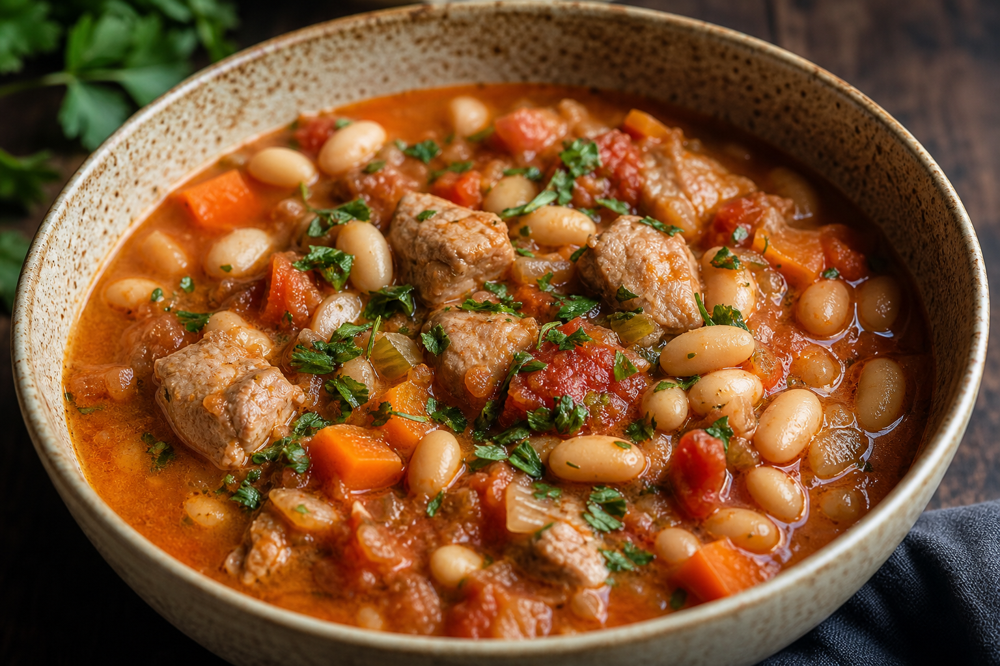

# Pork Cannellini Stew
<!-- quick:22 -->

Brown {130g {pork}} in {10g {olive_oil}} until the edges caramelize. Soften {60g {onion}}, {80g {carrot}}, and {5g {garlic}} in the same pot, then add {2g {smoked_paprika}}, {2g {rosemary}}, and {1g {bay_leaf}}. Stir in {180g {tomato}} and {150g {cannellini_bean}}; mash a spoonful of beans against the pot so the broth thickens. Simmer 15 minutes, then wilt in {80g {kale}} and finish with {8g {balsamic_vinegar}} for sweetness and shine.
