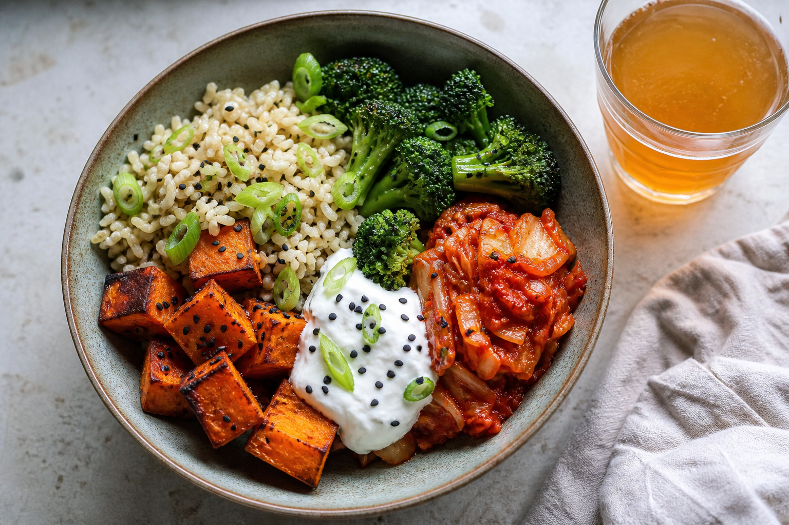

# Sweet Potato Kimchi Bowl
<!-- quick:15 -->

Roast {180g {sweet_potato}} (cubed) at 200°C for 18 minutes with {5g {sesame_oil}} until caramelized at the edges. Chop {70g {kimchi}} and warm it briefly in a pan with {100g {brown_rice}} so the kimchi juices season the rice. Stir {80g {yogurt}} with {5g {gochujang}} and a squeeze of {5g {lemon}} into a cool, creamy sauce. Bowl the rice with the sweet potato and {100g {broccoli}} (steamed), then swirl the yogurt sauce through — not on the side. Finish with {5g {sesame_seed}} and {8g {scallion}}.
