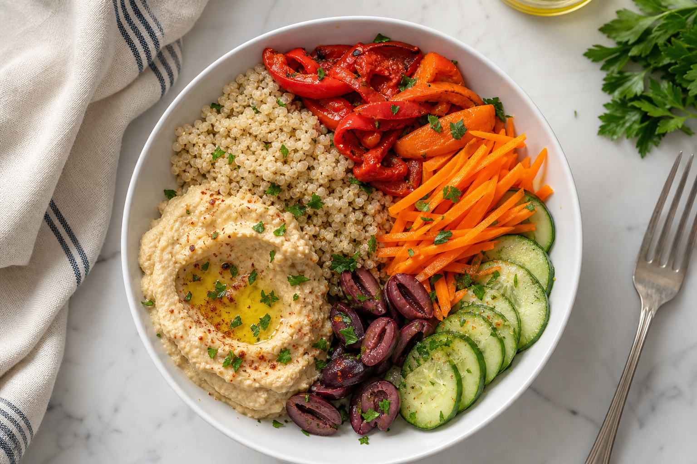

# Hummus Quinoa Bowl
<!-- quick:12 -->

Warm {120g {quinoa}}. Whisk {60g {hummus}} with {8g {lemon}} juice, {5g {olive_oil}}, and {3g {zaatar}} until loose enough to coat a spoon. Fold the warm quinoa into the hummus so it becomes creamy, not a dry pile with a hummus blob. Add {70g {bell_pepper}}, {60g {carrot}} (grated), {50g {cucumber}}, and {30g {black_olive}} (chopped). Finish with {25g {feta_cheese}}, {5g {olive_oil}}, and {5g {mint}}.
